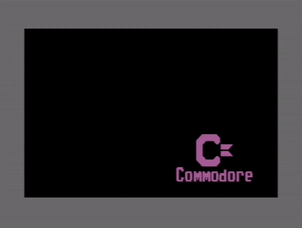

# commodoreLogoBounce
DVD Screensaver clone for the C64

Simple program in 6502 assembly that utilizes 8 sprites to form a logo that 'bounces' off the visible screen area, inspired by the popular DVD screensaver.

